#  Weather: Past or Forecast?

Weather: Past or Forecast is a command line application that allows the user to check past weather or get a weather forecast directly from the terminal.

This application is showcasing Python coding for Project Portfolio 3 and can be accessed by following this [link.](https://weather-past-or-forecast.herokuapp.com/)

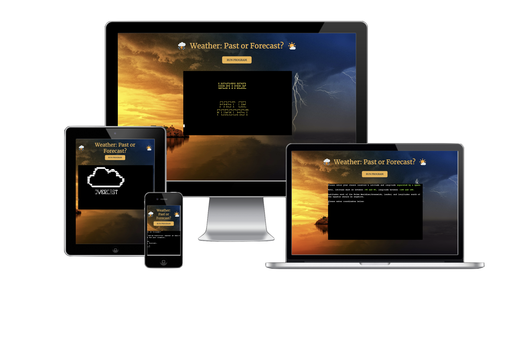

## Contents
<a name="contents"></a>

- [UX](#ux)
  - [Strategy](#strategy)
    - [User Stories](#user-stories)
  - [Scope](#scope)
    - [Essential Content](#essential-content)
    - [Optional Content](#optional-content)
  - [Structure](#structure)
  - [Skeleton](#structure)
    - [Wireframes](#wireframes)
  - [Surface(Design)](#surface-design)
    - [Colour Scheme](#colour-scheme)
    - [Imagery](#imagery)
    - [Favicon](#favicon)
    - [Typography](#typography)
- [Features](#features)
  - [Existing Features](#existing-features)
  - [Features Left to Implement](#features-left-to-implement)
- [Technologies Used](#technologies-used)
  - [Languages Used](#languages-used)
  - [Frameworks, Libraries & Programs Used](#frameworks-libraries--programs-used)
- [Testing](#testing)
  - [Development Testing](#development-testing)
  - [Testing User Stories](#testing-user-stories)
     - [User Goals](#user-goals)
     - [Site Administrator Goals](#site-administrator-goals)
  - [Validator Testing](#validator-testing)
  - [Bugs / Issues](#bugs--issues)
  - [Unresolved Bugs / Issues](#unresolved-bugs-or-issues)
- [Deployment](#deployment)
  - [Deploying to Heroku](#deploying-to-heroku)
  - [Forking the GitHub Repository](#forking-the-github-repository)
  - [Making a Local Clone](#making-a-local-clone)
- [Credits](#credits)
  - [Content](#content)
  - [Media](#media)

## UX
### Strategy
The objective of the site is to allow users to review past weather for a location in Ireland or obtain a weather forecast for a geographic location using coordinates.
#### User Stories
- User Goals:
  - To access the historical weather for a selected date at Dublin airport.
  - To access a 3 day weather forecast for a given location.
  - To be able to leave feedback on the app.
<br><br>
- Site Administrator Goals:
  - To give users the options to access historical weather, weather forecasts and have the option to create, read, update and delete (CRUD) feedback from the terminal.
  - To present data in as colourful a format as possible within the constraints of the terminal.
  - To create an application using Python with clean, resuable and commented code, utilising atomic functionality and OOP where appropriate.
  - To handle any potential errors appropriately and consistently.
  - To keep security sensitive information hidden.

### Scope
#### Essential Content
 - The app will allow users to enter a date and receive the weather for that given day.
 - The app will allow users to enter latitude and longitude coordinates to obtain a weather forecast for that location. 
#### Optional Content
- A feedback option where users can leave their feedback on the app.
### Structure
- The structure of the app was defined and mapped out on a [flow chart](views/README-files/flowchart.png). This helped define the required interactions to develop a usuable product.
- The structure of the data feeding into the historical or past weather of the app is via a Google Sheet called historical-weather-data.
### Skeleton
#### Wireframes
- The project wireframe can be found [here.](views/README-files/project-portfolio-three-wireframes.pdf)
### Surface (Design)
#### Colour Scheme
- The Termcolor library was used, providing *"ANSI color formatting for output in terminal"*.
- The availalble colours are limited however the following colour schemes were used for specific terminal outputs throughout the program:
  - **Errors**: errors (invalid entries, exceptions etc.) are formatted with bold white writing on a red background.<br><br>
  - **Information**: information that the user should know before taking an action formatted as bold green.<br><br> 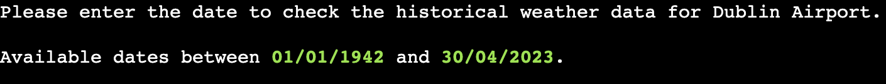
  - **Data**: pertinent data points either sourced/calculated from Google Sheets or Open Weather API are formatted as bold blue.<br><br> 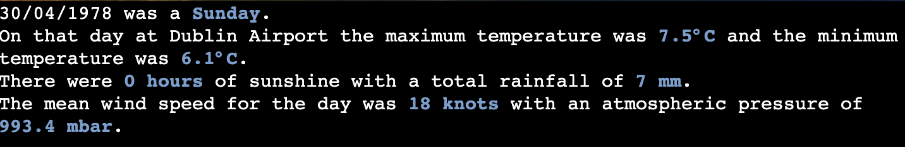
  - **Feedback**: a message to request the user does not leave the feedback message empty in bold magenta. Although this could be deemed an app error, I felt that the white on red would be too forceful to request feedback is entered. <br><br>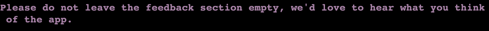
- There are a series of screens using text art to depict titles or loading information. Different colours were selected for each one to differentiate them from the others.
  - **Title**: Displayed when the program first runs.
  - **Loading**: Displayed when the program is loading data that may take time to load.<br><br>
  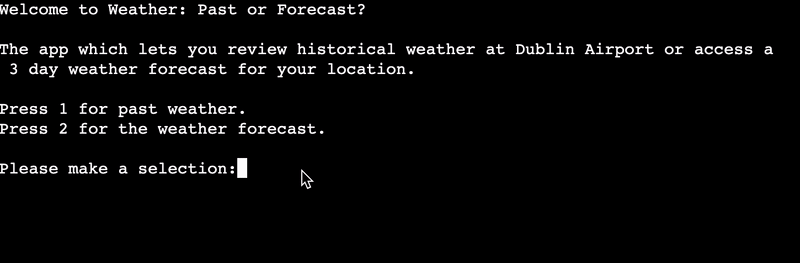
  - **Forecast Days**: Displayed when the program is about to display the weather for a given forecast day.  
- The two colours used for the title and button were selected from the background picture using the colour pallette dropper in keynote. The yellow *(Ronchi)* and dark blue *(Big Stone)* contrast each other well and are reminiscent of the weather types exhibited in the image.

#### Imagery
- The background image, sourced from [Pexels](https://www.pexels.com/), was selected for exhibiting a number of different weather types in one image.

- Two weather icon images were sourced from [Favicon.io](https://favicon.io/) to bookend the main title.<br><br>
 

#### Favicon
- The Favicon logo is the lightning bolt image described above.
#### Typography
- The title font was sourced from Google Fonts and is called Merriweather. This was selected purely on the presence of weather in the name and was seen as a good link back to the purpose of the app.<br><br>
<a href="#contents">BACK TO CONTENTS 🔼</a>

## Features 

### Existing Features

- __Starting App__ 
  - When the app first runs, a text art title appears followed by a 2 option main menu to either access past weather or run a weather forecast. <br><br>
- __Past Weather__ 
  - The past weather section starts with a series of informative statements and prompts ending with a user input requesting a date entry.
  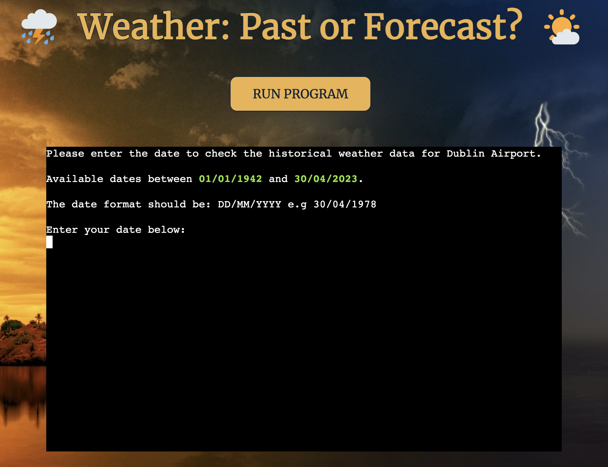
  - On entering a correctly formatted and in range date
  a series of statements are printed out in readable language with the data obtained or calculated from the Google Sheet formatted in bold blue.
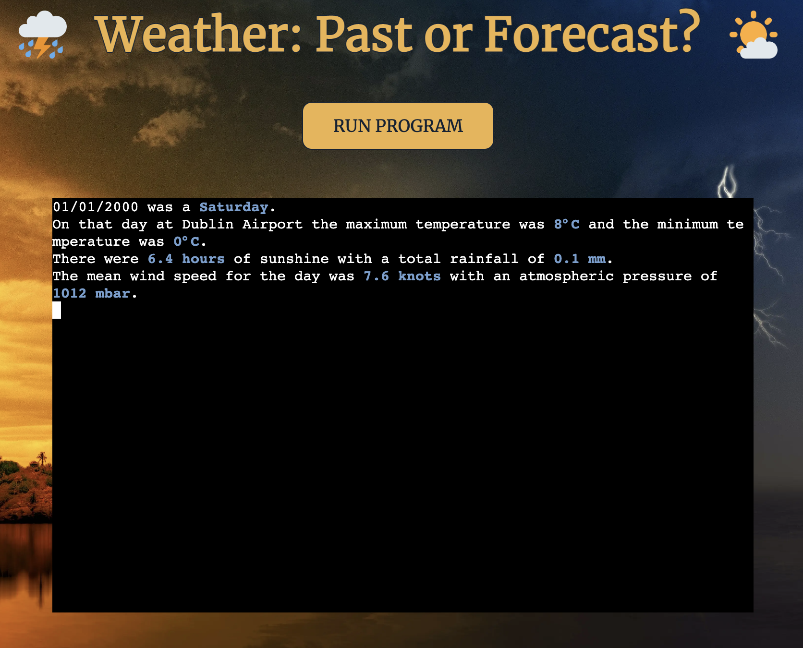 
  - After a short delay, a menu with four options is presented to allow the user to navigate elsewhere in the app or back to beginning of past weather.
 
 <br><br>
- __Weather Forecast__ 
  - The weather forecast section commences with a series of statements and prompts ending with a user input requesting entry of coordinates separated by a space. 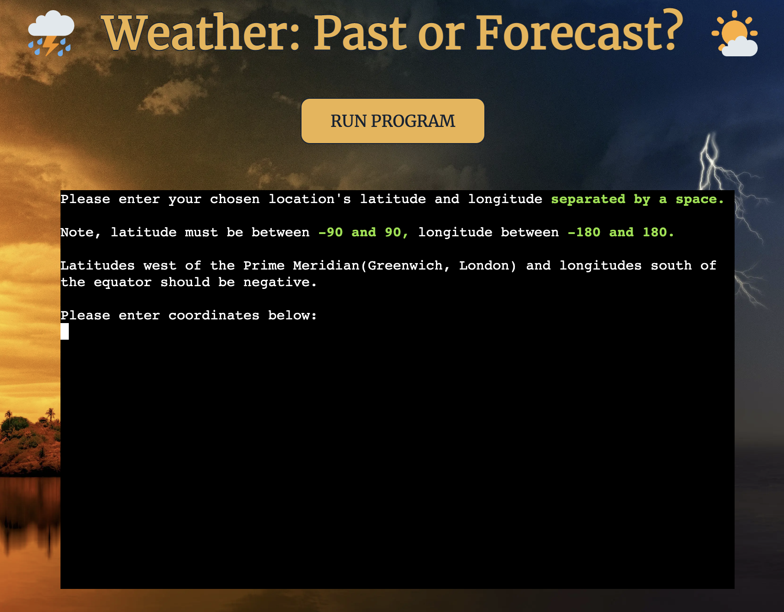
  - On input of correct data, todays forecast begins which consists of a title screen followed by feedback on location and date of forecast. This is then followed by weather icon with conditions underneath before a series of readable language statements is presented with the data obtained or calculated from the Open Weather API formatted in bold blue. 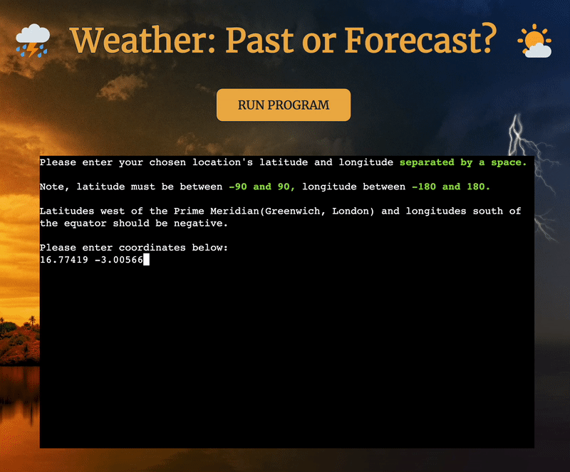
  - After a delay, a prompt to hit enter to see the next days forecast is presented to the user. Hitting enter runs tomorrows forecast which is identical in format to the process above with exception of the title screen. 
  - At the end of tomorrows forecast the user is again requested to hit enter which then returns the day after tomorrows forecast. The format is again identical to the previous two forecasts with the exception of the title screen.
  - At the end of the day after tomorrows forecast, the user options menu is presented with the same options as described in the past weather features section and an additional option to see a three day summary.
  - Selecting option five returns a tabulated summary of the three forecast days followed by a propmt to hit enter to access user options. Doing so returns the four option menu previously described.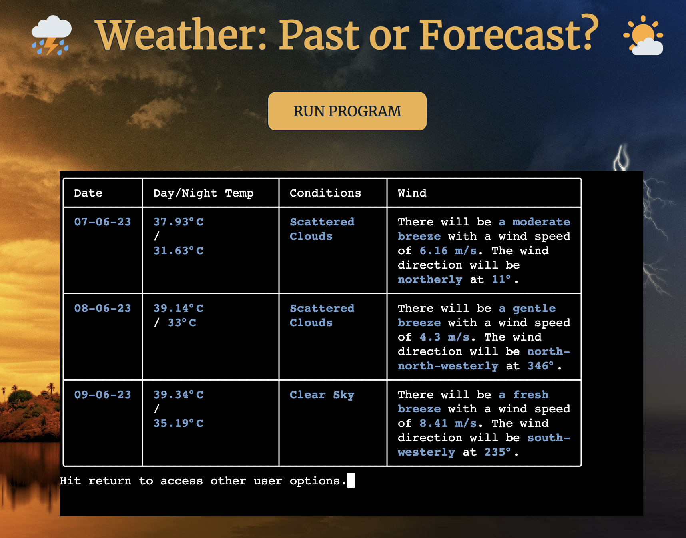<br><br>

- __Feedback__ 
  - The feedback section allows users to enter their name and any feedback they have on the app. Once these details are created on the feedback worksheet of the historical-weather-data sheet they are repeated back to the user in a tabulated format.
  - There also appears an options menu beneath where the user can select to change their name, change their feedback, confirm they are happy with the feedback or delete it altogher.
  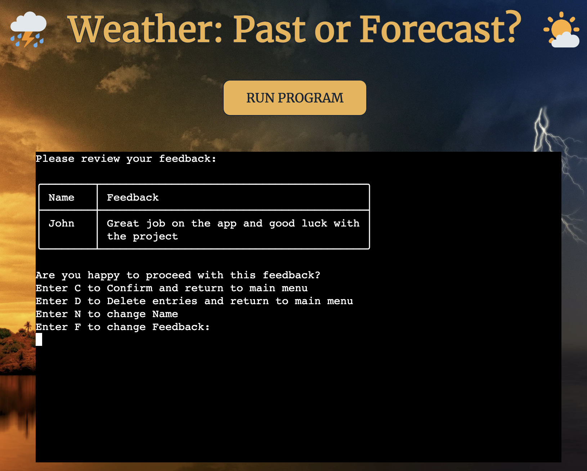<br><br>

### Features Left to Implement
- My initial thoughts regarding the ASCII weather icons was for them to be multicoloured. However I felt that the time required to investigate the feasibilty and implement this visual feature was not worth the effort giving no real functional difference.

<a href="#contents">BACK TO CONTENTS 🔼</a>

## Technologies Used

### Languages Used
- **Python**: used extensively during project.
- **Markdown**: Used exclusively for README.
- **HTML5**: minor use when adding additional elements to the web page.
- **CSS3**: minor use when applying styling to app view.<br>

### Frameworks, Libraries & Programs Used
- **termcolor**: used to apply foreground and background colors to terminal text.
- **datetime**: from the standard library, used to perform operations on date and time objects and strings.
- **numpy**: used to create a range of floats due to python range only returning a range of integers.
- **itertools**: from standard library used to iterate over list for loading animation.
- **pyowm**: library with classes used to manage Open Weather API calls.
- **time**: from the standard library used to access sleep method for pauses during pertinent points of relaying information to the user.
- **os**: from the standard library used to access system method to clear terminal screen at appropriate points whilst the program is running.
- **tabulate**: used to create a table of contents in the feedback and weather forecast sections of the app.
- **threading**: used to enable multithreading operations used for loading screens.
- **Code Institute PEP8 Linter**: used to perform check of Python code.
- **Open Weather API** used to access weather forecast data for given coordinates.A one call subscription was made for this service which enables 1000 calls per day free before entering the payment tier.
- **Keynote** use of eyedropper in colour pallette to select CSS theme colours.
- **Apple Maps App** used to obtain GPS coordinates for testing app.
- **Apple Weather App** used for comparing app output for given locations.
- **Code Anywhere** cloud based IDE used during earlier part of the project.
- **Gitpod** cloud based IDE used for majority of the project.
- **Git** used for version control.
- **GitHub** as cloud repository for Git version control.
- **gspread**: used to complete CRUD actions on Google Sheets.
- **Credentials**: imported from google.oauth.serivice_account to enable access to Google Sheets.
- **Google Sheets*** a cloud based service where the historical-weather-data spreadsheet containing two worksheets was utilised for this project.
  - The first sheet, named *archive*, contains all historical weather data for Dublin Airport, downloaded from Met Eireann. 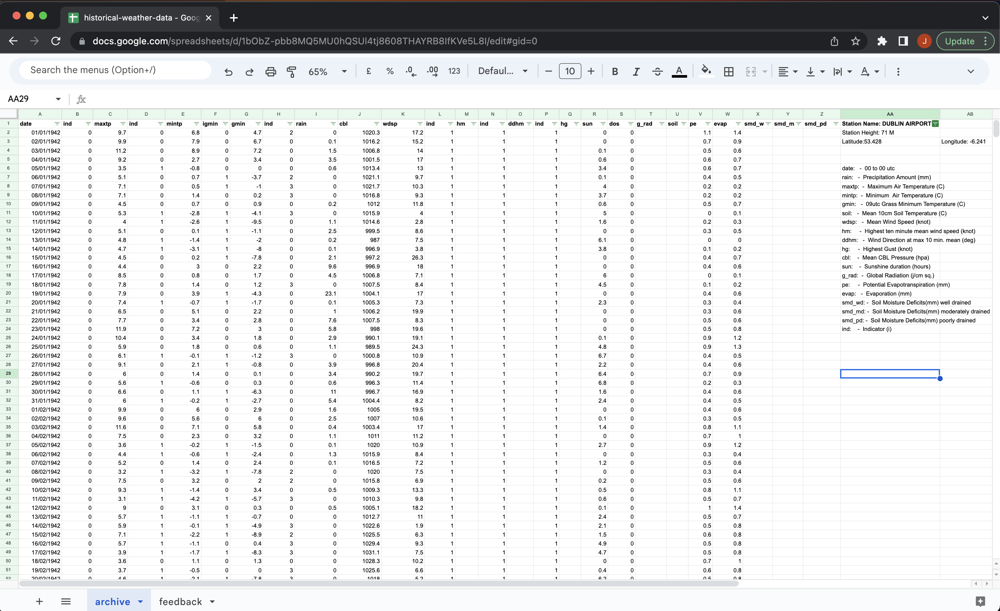
  - The second sheet, named *feedback*, is the repository for user feedback. 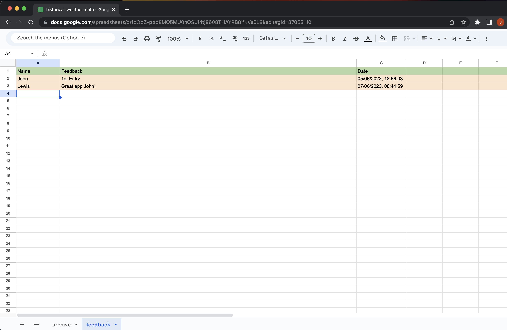

<br><a href="#contents">BACK TO CONTENTS 🔼</a>
## Testing 
### Development Testing

- __Starting Options__
  - The app started successfully using the Run Program button with the title ANSI graphic title text being presented followed by the main menu.
  - Entering 1 or 2 directed the user to the correct section of the app.  
  - Various errors were purposefully entered into the terminal to check the app response as detailed below:
    - *Non-integer entry*: a variety of non-integer entries were made with the expected response detailed below:  The message remained on screen for 3 seconds at which point the main menu reappears to allow the user to try again.
    - *Invalid number*: a variety of integers other than 1 or 2 were inputed with the expected response detailed below: <br> The message persisted as detailed in error above for same period before returning to main menu..
    <br><br>
- __Past Weather__
  - The past weather date entry page loaded successfully giving the user the information required and the correct prompt to enter the selected date.
  - When a valid date is entered, the screen cleared and the past weather was displayed as expected. 
  - The four user options menu was presented with each one working satisfactorily. 
  - Various errors were purposefully entered into the terminal to check the app response as detailed below:
    - *Incorrect date format*: a variety of non-date related strings and characters were entered into the terminal with the expected response detailed below:  The message remained on screen for 3 seconds at which point the Past Weather date entry page reappears to allow user to try and enter a date again.
    - *Date out of range*: a date outwith the data range contained in the Google Sheet was entered. The loading screen was presented allowing the program to check the date given lies within the archive data range. As expected, the program presented the user with the following error message: As in the message above, it remained on screen for 3 seconds before returning to the Past Weather date entry page.
- __Weather Forecast__
  - The forecast weather coordinate entry page loaded successfully giving the user the information required and the correct prompt to enter the required latitude and longitude. 
  - On receipt of valid coordinates, the app presented todays forecast in the expected manner and format. 
  - Hitting enter when prompted progressed the app through tomorrows and day after tomorrows forecasts, both of which presented as expected.
  - At the end of the day after tomorrows forecast, the five user options menu was presented with each one working satisfactorily. 
  - The 3 day summary option was selected and presented back the 3 forecasts in the correct format.
  - Coordinates were entered for my home, Edinburgh and Toronto with the corresponding weather forecasts cross checked. Each one was a close aproximation of that provided by iOS.
  - Storm Biparjoy - at time of writing in the Indian Ocean - was used to test the wind information in the forecast, comparing with current windspeed returned from [Earth NullSchool.](https://earth.nullschool.net/)
  
  
  - Various errors were purposefully entered into the terminal or manaully created to check the app response as detailed below:
    - *Single entry*: a single entry was made in the terminal which correctly resulted in the error message below:  The message remained on screen for 3.5 seconds (longer than normal due to length of string) at which point the Weather Forecast coordinate entry page reappears to allow user to try and enter coordinates again.
    - *Too many entries*: three numbers were entered which resulted in the error message below:  The message persisted for 3.5 seconds before returning to the coordinate entry page.
    - *Latitude out of range*: a latitude was entered which was not within the acceptable range of -90 to 90 resulting in the error message below:  The message persisted for 3 seconds before returning to the coordinate entry page.
    - *Longitude out of range*: a longitude was entered which was not within the acceptable range of -180 to 180 resulting in the error message below:  The message persisted for 3 seconds before returning to the coordinate entry page.
    - *API errors*: a single digit was deleted from the API key config var in Heroku to simulate an error returned from the API which generated the message below:  The message persisted for 3 seconds however in this instance, the user menu was made available as the user may want to navigate away from the Weather Forecast, given that the error came from the API so may be a time bound issue on the providers side.

- __Feedback__
  - Entering name and feedback created a new entry in the feedback worksheet, along with a date for the feedback.
  - An empty name input returned the string *anonymous* as expected.
  - When the feedback was left blank, an attention message was presented to the user with an option to leave feedback reappearing shortly afterward. 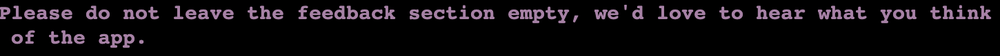
  - The data was then read back from the worksheet and presented to the user in a table as expected.
  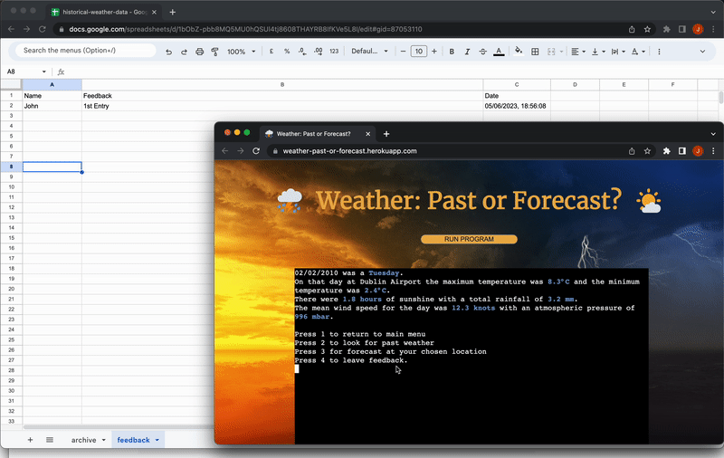<br><br>
  - The user options were presented and updating the spreadsheet was tested successfully. 
  - The delete option was also tested and worked as expected, presenting a message before returning to the main menu. 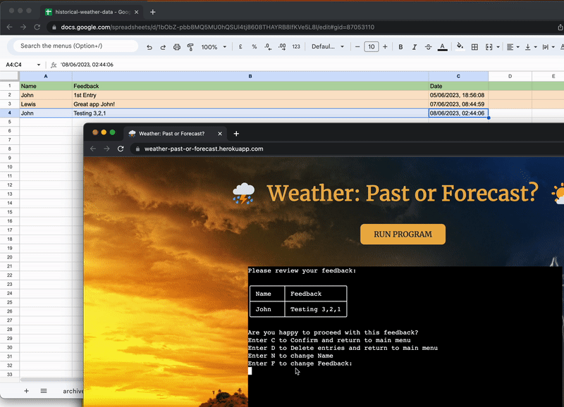
  - The confirm option was also tested which presented the thank you message and returned the program to the main menu. 

- __User Options__
  - The two User Options formats - 4 choice and 5 choice - were both presented at the appropriate time: past weather and weather forecast respectively.
  - Each option was selected to confirm direction to the appropriate part of the app.

### Testing User Stories
#### User Goals
- **To access the historical weather for a selected date at Dublin airport.**
  - The app prompts the user to enter a chosen date to access the data. 
  - The app then presents the data back to the user, fulfilling the requirements of this user goal.

- **To access a 3 day weather forecast for a given location.**

  - The user is prompted to enter a latitude and longitude at the appropriate time.
  - The user is then presented with a series of forecasts, achieving the objective of this goal.

- **To be able to leave feedback on the app.**

  - The user is provided an option to leave feedback at the end of either the past weather or weather forecast sections.
  - The feedback persists in a Google Spreadsheet. 

#### Site Administrator Goals
  - **To give users the options to access historical weather, weather forecasts and have the option to create, read, update and delete (CRUD) feedback from the terminal.**

    - The user can access historical weather from the historical-weather-data Google Sheet, return a weather forecast for a given location via Open Weather API and is able to Create, Read, Update and Delete the feedback data using terminal commands.
  - **To present data in as colourful a format as possible within the constraints of the terminal.**

    - The termcolor library was utilised to apply colorised formatting to terminal outputs, making key information stand out to the user.
  - **To create an application using Python with clean, resuable and commented code, utilising atomic functionality and OOP where appropriate.**

    - The code has been broken into discrete files to try and group together code in an ordered manner that seeks to follow the flow of the program.
    - OOP was utilised for actions or events where properties and methods are required. In the case of the Weather Forecast, OOP would enable scaling up to more forecast days or adding functionality from currently unused API data.
    - The functions have been written in a way such that they are atomic and perform discrete operations. The main.py file has many examples of function calls in order to create the end result.
    - Code is commented throughout to provide future proofing and all functions are annotated with a docstring.
  - **To handle any potential errors appropriately and consistently.**

    - Throughout the app there are multiple points where error handling is required. This is achieved through try/except in most cases along with if/else statements. 
    - The error handling messages all have the same formatting to provide consistency.
  - **To keep security sensitive information hidden.**

    - The Open Weather API key is stored as an environment variable in Heroku project config vars and testing API key added to gitignore file.
    - Google Sheets access requirements contained in the creds.json file also added to gitignore file. The json file is also stored as a config var in Heroku.

### Validator Testing 

- HTML
  - No errors or warnings were returned for the page when passing through the official W3C HTML validator:
    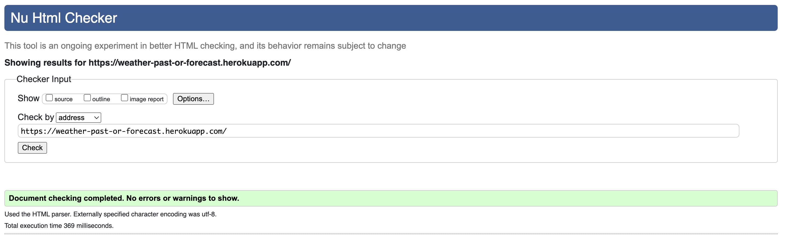<br><br> 
    
- CSS
  - No errors were returned for the page when passing through the official W3C CSS validator:
     
    There were two warnings returned, both linked to code that existed from the CI template.<br><br>

- Python
  - Each Python file was passed through the Code Institute Linter. The initial results are detailed [here.](views/README-files/linter-results.pdf) After refactoring, the code was passed through the linter again and the results are shown below.
    - The classes.py file was passed through the linter with no warnings or errors returned.
  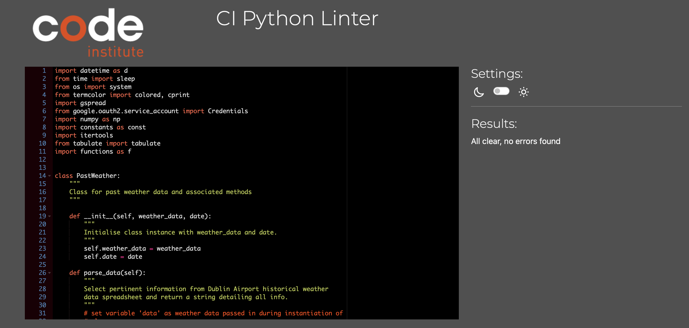<br><br> 
     - The constants.py file was passed through the linter with no warnings or errors returned.
  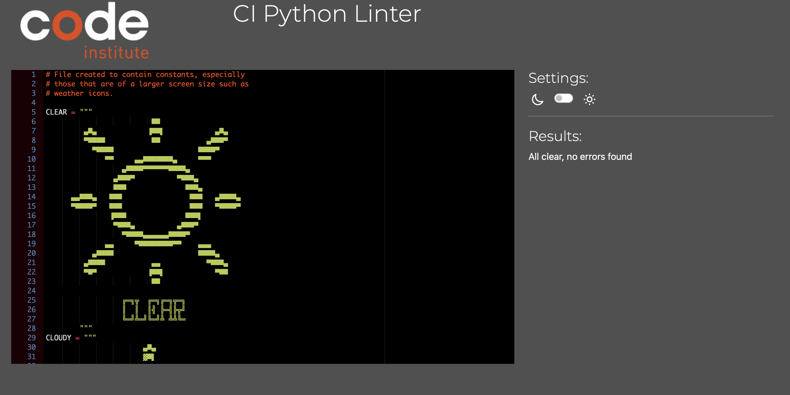<br><br> 
    - The functions.py file was passed through the linter with no warnings or errors returned.
  <br><br> 
    - The past_weather.py file was passed through the linter with no warnings or errors returned.
  <br><br> 
    - The run.py file was passed through the linter with no warnings or errors returned.
  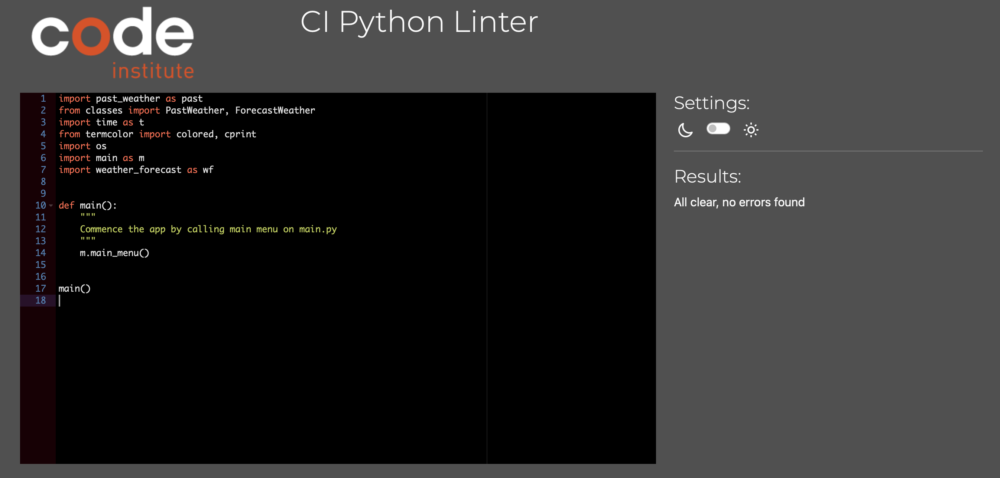<br><br>  
    - The weather_forecast.py file was passed through the linter with no warnings or errors returned.
  <br><br>  

- Accessibility
  - Accessibility of the page was checked using the lighthouse tool in devtools. The results were satisfactory as shown below. 
     - Desktop results:
     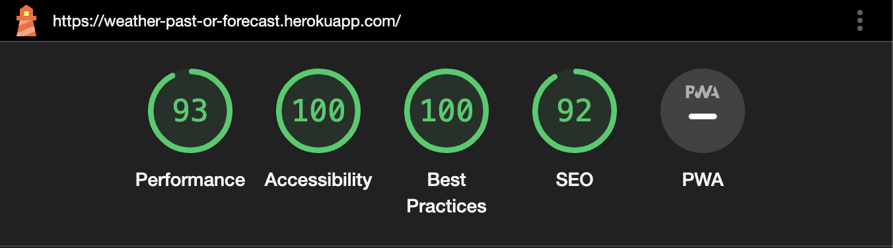 <br><br>
  - The title and button colour contrasts were checked using Web AIM contrast checker.
  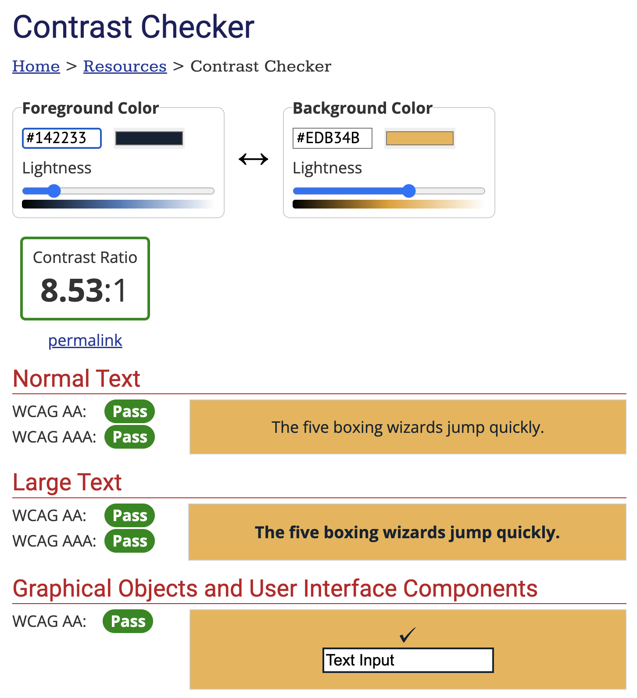
  <br><br>

 
<a href="#contents">BACK TO CONTENTS 🔼</a>
### Bugs / Issues

<table  width = 100% cellspacing="0" cellpadding="0">
   <tr>
   <th>Issue/Bug</th>
   <th>Solution</th>
   </tr>
   <tr>
   <td>Issue with PastWeather class sunshine duration if statement. Converting string to int caused an error due to decimal point as discovered when checking weather for 01/01/2020. </td>
   <td>Changed to conversion from string to int, to string to float.</td>
   </tr>
   <tr>
   <td>Encountered the following error " NameError: name 'main' is not defined". Error caused by call to main() function from past_weather file</td>
   <td>Imported run_past_weather function to resolve</td>
   </tr>
   <tr>
   <td>Unable to return to run.py from feedback file and it was not recommended to use exec file function. </td>
   <td>Opted to make feedback a Class instead.</td>
   </tr>
   <tr>
   <td> Tried to deploy to Heroku app but got ModuleNotFoundError for termcolor and pyowm.</td>
   <td>Added both libraries to requirements.txt file</td>
   </tr>
   <tr>
   <td>Issue with run_past_weather call from past_weather.py file. Caused multi-threading of loading graphic and code getting caught in loop. </td>
   <td>Resolved by passing boolean and error message back to run_past_weather and deal with error there.</td>
   </tr>
   <tr>
   <td>Favicon would not load in the title bar.</td>
   <td>Resolved by adding Github raw link.</td>
   </tr>
    <tr>
   <td>Feedback running twice despite selecting delete/return to main menu. Suspect issue with running function from inside the existing function. Same issue occurred when changing feedback and no string passed to sheet despite one being entered.</td>
   <td>Added while loop to resolve issue in both instances.</td>
   </tr>
    <tr>
   <td>Encountered error in weather_forecast.py file in get_user_coordinates function where a correct entry made latitudes or longitudes were out of range did not pass any values on to the get weather forecast function.</td>
   <td> Added a continue as opposed to calling get_user_coordinates again followed by return.
   </td>
   </tr>
    <tr>
   <td>Issue with element misalignment on some screens identified by Steve Doherty in peer code review.
   <br>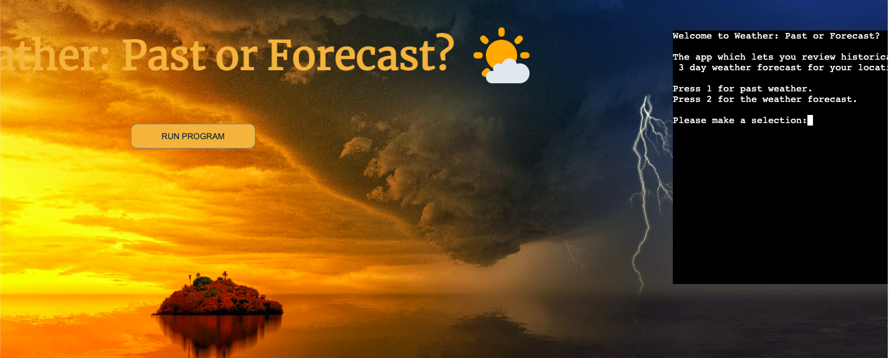</td>
   <td>Flex-wrap attribute had been mistakenly adde to style. Issue resolved when attribute removed.</td>
   </tr>
   </tr>
   <tr>
   <td>W3 validator return error “Attribute size not allowed on element link at this point.”</td>
   <td>Removed size attribute from link.</td>
   </tr>
   <tr>
   <td>Issue with retention of top part of 3 day forecast table after system clear command as identified by Lewis Dillon in peer code review.</td>
   <td>Added system(‘clear’) code to resolve.</td>
   </tr>
   <tr>
   <td>Issue again identified by Lewis Dillon where Russian coordinates cause the following error: “Event Description Must be Specified”.</td>
   <td> I checked API call in browser address bar and observed that JSON returned ‘alerts’ for the region. Excluded alerts from the API call which resolved the issue.</td>
   </tr>
  </table>

### Unresolved Bugs or Issues
- Issue with weather forecast where weather icons move off screen as the weather forecast data prints out and the system clear command does not remove the off screen content. I searched for a solution but could not find anything concrete and decided to opt for a workaround to maintain progress with the project. The solution I adopted was to clear the weather icon from the screen before the weather forecast data is printed. I classify this as unresolved due to the fact I would have preferred the weather icon to remain on screen as the forecast prints out. <br><br>
<a href="#contents">BACK TO CONTENTS 🔼</a>

## Deployment

### Deploying to Heroku
* This site was deployed by completing the following steps:

1. Log in to [Heroku](https://id.heroku.com) or create an account.
2. On the main page click the button labelled New in the top right corner and from the drop-down menu select Create New App.
3. You must enter a unique app name.
4. Next select your region.
5. Click on the Create App button
6. The next page is the project’s Deploy Tab. Click on the Settings Tab and scroll down to Config Vars.
7. Click Reveal Config Vars and enter the following:
    - Add port into the Key box and 8000 into the Value box and click the Add button.
    - Enter CREDS into the next available Key box and the Google credentials into the corresponding Value box.
    - Enter API_KEY into the next available Key box and the Open Weather API key into the corresponding Value box.
8. Next, scroll down to the Buildpack section click Add Buildpack select python and click Save Changes.
9. Repeat step 8 to add node.js. o Note: The Buildpacks must be in the correct order. If not click and drag them to move into the correct order.
10. Scroll to the top of the page and choose the Deploy tab.
11. Select Github as the deployment method.
12. Confirm you want to connect to GitHub.
13. Search for the repository name and click the connect button.
14. Scroll to the bottom of the deploy page and select the preferred deployment type.
15. Click either Enable Automatic Deploys for automatic deployment when you push updates to Github.

### Forking the GitHub Repository

By forking the GitHub Repository we make a copy of the original repository on our GitHub account to view and/or make changes without affecting the original repository by using the following steps:

1. Log in to GitHub and locate the [GitHub Repository.](https://github.com/johnamdickson/Portfolio-Project-3)
2. At the top of the Repository (not top of page) just above the "Settings" Button on the menu, locate the "Fork" Button.
3. You should now have a copy of the original repository in your GitHub account.

### Making a Local Clone

1. Log in to GitHub and locate the [GitHub Repository.](https://github.com/johnamdickson/Portfolio-Project-3)
2. Under the repository name, click "Clone or download".
3. To clone the repository using HTTPS, under "Clone with HTTPS", copy the link.
4. Open Git Bash
5. Change the current working directory to the location where you want the cloned directory to be made.
6. Type `git clone`, and then paste the URL you copied in Step 3.

```
$ git clone https://github.com/YOUR-USERNAME/YOUR-REPOSITORY
```

7. Press Enter. Your local clone will be created.

```
$ git clone https://github.com/YOUR-USERNAME/YOUR-REPOSITORY
> Cloning into `CI-Clone`...
> remote: Counting objects: 10, done.
> remote: Compressing objects: 100% (8/8), done.
> remove: Total 10 (delta 1), reused 10 (delta 1)
> Unpacking objects: 100% (10/10), done.
```

Click [Here](https://help.github.com/en/github/creating-cloning-and-archiving-repositories/cloning-a-repository#cloning-a-repository-to-github-desktop) to retrieve pictures for some of the buttons and more detailed explanations of the above process.<br><br>
<a href="#contents">BACK TO CONTENTS 🔼</a>
## Credits 
### Content 
NOTE: Specific links are included within the Python, HTML, CSS  files. The list below summarises content credits in general.
- Stack Overflow, W3 Docs and other online resources were a massive help for Python, HTML or CSS code that enabled some of the functionality I was looking for.
- The past weather data in csv format was obtained from Met Eireann historical archive[here.](https://www.met.ie/climate/available-data/historical-data)
- Beafort scale used to describe weather from given wind speed. Source in [Wikipedia.](https://en.wikipedia.org/wiki/Beaufort_scale)
- Cardinal and ordinal wind directions taken from [Windy](https://windy.app/blog/what-is-wind-direction.html).
- Weather codes and corresponding weather conditions from [Open Weather.](https://openweathermap.org/weather-conditions)
- Information on geographic coordinate system found [here.](https://www.ibm.com/docs/en/db2/11.1?topic=systems-geographic-coordinate)
- This [website](https://www.scaler.com/topics/multiline-comment-in-python/) gave guidance for making multi-line comments where using `“””` is recommended for docstrings and using `#` for comments.
- The idea to use the Open Weather API was inspired by the Clima project, taught as part of the London App Brewery's iOS App Development Bootcamp.
- Deployment information to Heroku derived from PP3 weekly open stand up [example project.](https://github.com/PedroCristo/portfolio_project_3/blob/main/README.md)
- Background image and other styling from other PP3 weekly open stand up [example project.](https://github.com/useriasminna/american_pizza_order_system)
- The Love Sandwiches walkthrough project gave much inspiration for my PP3.
- Thanks to my tutor Gurjot for his advice during the mentoring sessions.
- Thanks to Steve Doherty and Lewis Dillon for their code review feedback of which I was able to resolve three errors.
### Media
- Merriweather font was sourced from Google Fonts.
- All gifs were generated on [ezgif.com.](https://ezgif.com/video-to-gif)
- The ASCII weather icons were generated [here](https://asciiart.club/) using icons sourced from [Flaticon](https://www.flaticon.com/). <br>
  <sub>*A full list of icons used with corresponding links can be found [here](views/README-files/flaticon-links.pdf).*</sub>
- ASCII title text was generated using this [Text to ASCII Art Generator.](https://patorjk.com/software/taag)
- ASCII weather forecast icons were generated [here.](
https://asciiart.club/ )
- The background image was taken from [Pexels](https://www.pexels.com/photo/island-during-golden-hour-and-upcoming-storm-1118873/). Photo by Johannes Plenio.
- The colour names were sourced from [Name That Color.](https://chir.ag/projects/name-that-color/)
- The site colour scheme pallete was generated using the palette creation tool in [Color Hex.](https://www.color-hex.com/) 
- The title icons were from [Favicon](https://favicon.io/) which in turn sourced them from [Twemoji.](https://twemoji.twitter.com/)
- Current wind speeds were taken from [Earth Nullschool.](https://earth.nullschool.net/)
- Storm Biparjoy details obtained from [Accuweather.](https://www.accuweather.com/en/hurricane/indian/biparjoy-2023)
<br><br>
<a href="#contents">BACK TO CONTENTS 🔼</a>
